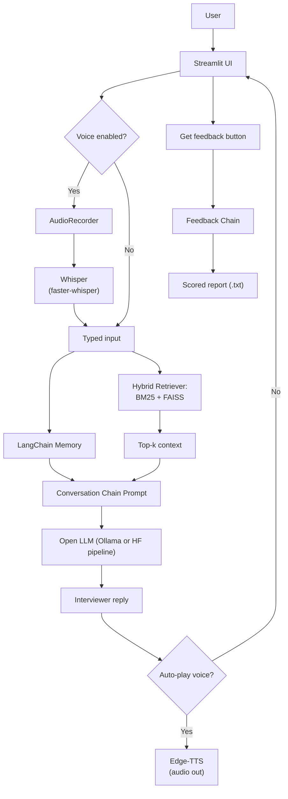

# AI Interview Coach 🎤
_Voice-interactive, document-grounded mock interviews with inspectable hybrid retrieval._


---

## Table of contents
- [Highlights](#highlights)
- [Architecture](#architecture)
- [Prerequisites](#prerequisites)
- [Install & run](#install--run)
- [Environment config](#environment-config)
- [Usage](#usage)
- [Performance tips](#performance-tips)
- [Research reproducibility](#research-reproducibility)
- [Tests](#tests)
- [Security](#security)
- [Troubleshooting](#troubleshooting)
- [Project layout](#project-layout)
- [License](#license)

---

## Highlights

- **Three interview modes**
  - **Professional (JD‑based)** — paste a job description; the app builds a guideline and asks one focused technical question per topic.
  - **Behavioral** — STAR‑style soft‑skill questions with rubric‑based feedback.
  - **Résumé** — parse your PDF and drill into your actual experience.
- **Voice I/O** — local Whisper STT + Edge‑TTS for natural conversation.
- **Mode-adaptive hybrid retrieval** — BM25 and Sentence-Transformers/FAISS
  scores are min-max normalised and fused with transparent weights:
  technical `alpha=0.8`, behavioural `alpha=0.2`, and resume `alpha=0.4`.
- **Inspectable provenance** — retrieved context carries stable source/chunk IDs.
- **One‑click report** — strengths, gaps, and an overall score you can download.

---

## Architecture


```mermaid
flowchart TD
  A[User] --> B[Streamlit UI]

  %% Input path
  B --> C{Voice enabled?}
  C -- Yes --> D[AudioRecorder]
  D --> E["Whisper\n(faster-whisper)"]
  C -- No --> F[Typed input]
  E --> F

  %% Retrieval & memory
  F --> G[LangChain Memory]
  F --> H["Hybrid Retriever:\nBM25 + FAISS"]
  H --> I[Top-k context]

  %% Conversation
  G --> J[Conversation Chain Prompt]
  I --> J
  J --> K["Open LLM (Ollama or HF pipeline)"]
  K --> L[Interviewer reply]

  %% TTS
  L --> M{Auto-play voice?}
  M -- Yes --> N["Edge-TTS\n(audio out)"]
  M -- No --> B

  %% Feedback
  B --> O["Get feedback" button]
  O --> P[Feedback Chain]
  P --> Q["Scored report (.txt)"]

```
<details><summary>ASCII fallback (if Mermaid is disabled)</summary>

```
User -> Streamlit UI -> (voice?) -> AudioRecorder -> Whisper -> text
text -> Memory + Hybrid Retriever(BM25+FAISS) -> Context with chunk IDs
Context + History -> Prompt -> Open LLM -> Reply
Reply -> (autoplay?) -> Edge-TTS -> Audio
[Optional] "Get feedback" -> Feedback chain -> report.txt
```
</details>

---

## Prerequisites

- **Python**: 3.11.x recommended  
- **Optional Ollama** for local LLMs (`LLAMA3`, `mistral`, etc.) or use the built‑in CPU HF pipeline fallback
- **Optional GPU for STT (Whisper)** — tested on HP Victus (RTX 3060)
  - NVIDIA driver (recent)
  - CUDA Toolkit **12.x or 13.x**
  - cuDNN **9.x** (ensure `cudnn_ops64_9.dll` is on `PATH`)
  - _LLM calls are local (Ollama or CPU HF pipeline); GPU is only for Whisper._

---

## Install & run

```bash
# 1) Clone
git clone https://github.com/souvikDevloper/AI-Interview-Coach.git
cd AI-Interview-Coach

# 2) Create venv
python -m venv .venv
# Windows:
. .venv\Scripts\activate
# macOS/Linux:
# source .venv/bin/activate

# 3) Install deps
pip install -r requirements.txt

# 4) Run
streamlit run Homepage.py
```

**CUDA Whisper sanity check (PowerShell):**
```powershell
$code = @"
from faster_whisper import WhisperModel
try:
    WhisperModel("small", device="cuda", compute_type="float16")
    print("✅ CUDA Whisper OK")
except Exception as e:
    print("❌ CUDA Whisper failed:", e)
"@
python -c $code
```

---

## Environment config

Optional `.env` (for custom models):

```
# LLM backend (local Ollama is the paper-aligned default)
LLM_BACKEND=ollama           # or groq
OLLAMA_MODEL=llama3
OLLAMA_BASE_URL=http://localhost:11434
# GROQ_API_KEY=               # only when LLM_BACKEND=groq

# Embeddings
EMBED_MODEL=sentence-transformers/all-MiniLM-L6-v2

# STT settings (defaults shown; model loading is lazy)
WHISPER_MODEL=small.en       # tiny/base/small/medium/large-v3 or *.en
WHISPER_DEVICE=auto          # auto, cuda, or cpu
WHISPER_COMPUTE=auto         # auto, float16, float32, int8_float16, or int8
WHISPER_ALLOW_FALLBACK=1     # retry on CPU if CUDA initialization fails
WHISPER_DEVICE_INDEX=0
```

---

## Usage

1. Open **Homepage** → pick **Professional**, **Behavioral**, or **Résumé**.
2. **Professional**: paste JD → toggle voice if you like → answer questions.
3. **Behavioral**: enter prompt/keywords → answer.
4. **Résumé**: upload PDF → pick position → answer.
5. Hit **Get feedback** any time to download a scored report.

---

## Performance tips

- **Chunking / retriever**: the versioned paper configuration uses 500-token-like
  windows, 50-token overlap, and top-k 4. Change these only with a documented
  evaluation and a new prompt/configuration version.
- **Turn cap**: each screen enforces **MAX_TURNS** to keep sessions ~10–15 min.
- **Voice off**: if your mic is flaky, disable voice to remove STT overhead.

---

## Troubleshooting

| Symptom | Fix |
|---|---|
| `cudnn_ops64_9.dll missing` | Ensure cuDNN `bin` is on PATH. Example (PowerShell): `setx PATH "$env:PATH;C:\Program Files\NVIDIA\CUDA\v13.0\bin;C:\Program Files\NVIDIA\CUDNN\v9.12\bin\13.0"` then open a **new** terminal. |
| `Requested int8_float16 compute type...` | Your backend doesn’t support that mix. Use `WHISPER_COMPUTE=auto`, or set `float16` for a compatible GPU / `int8` for CPU. |
| Ollama connection refused | Start the daemon: `ollama serve` (or install from https://ollama.com). |
| `Prompt is too long` | Your JD/résumé is huge. Reduce chunk size/overlap or lower retriever `k`. |
| `ModuleNotFoundError: streamlit_lottie` (or others) | `pip install -r requirements.txt` inside the **activated** `.venv`. |
| Repeating questions | Conversation uses message history + asked‑topics memory. If you still see repeats, increase MAX_TURNS or clear session state. |
| Git repo too big | Add `.venv/`, `models/**`, `*.dll`, `*.pyd`, `*.bin`, `*.safetensors` to `.gitignore`. Clean history: `git filter-repo --invert-paths --path .venv --path models --path '*.dll' --path '*.pyd' --path '*.bin' --path '*.safetensors'`. |

---

## Research reproducibility

The `reproducibility/` directory contains header-only item-level schemas,
privacy boundaries, validation commands, and a cluster-aware paired analysis.
No synthetic fixture is represented as human-study evidence. The small files
under `tests/fixtures/` exist only to verify code behavior.

Typical validation and analysis:

```bash
python scripts/validate_evidence.py retrieval retrieval_items.csv
python scripts/analyze_clustered.py retrieval_items.csv --treatment D --control A \
  --output clustered-results.json
python scripts/analyze_misc_clustered.py misc_codes.csv \
  --treatment proposed --control baseline --output misc-clustered-results.json
python scripts/analyze_wer.py wer_utterances.csv --output wer-results.json
python scripts/analyze_survey.py survey_items.csv \
  --group discipline_group --group year_group --output survey-results.json
python scripts/build_evidence_manifest.py approved-archive \
  --output approved-archive/evidence-manifest.json
```

The LoRA hyperparameters are versioned in `configs/lora_llama2_7b.json`.
`scripts/train_lora.py --validate-only` validates the approved corpus contract;
weights or participant-derived training pairs must not be published unless
their approval and consent basis permits it.

---

## Tests

```bash
python -m unittest discover -s tests -v
python -m compileall ai_interview_coach pages scripts
```

The suite checks adaptive retrieval weights, BM25/dense fusion, chunk
provenance, paired and independent cluster-first inference, WER, survey
reliability, evidence ranges, duplicate IDs, direct identifier rejection,
speech-device selection, and manifest checksums. CI also runs every evidence
analysis CLI against explicitly synthetic fixtures.

---

## Security

Never commit `.env`. Copy `.env.example` locally and keep all keys blank in
committed files. If a real key has ever been committed, remove the file from
tracking and rotate the credential; deleting it from the latest commit does not
remove it from repository history.

---

## Project layout

```
AI-Interview-Coach/
├─ ai_interview_coach/
│  ├─ retrieval.py            # BM25 + dense mode-adaptive fusion
│  ├─ analysis.py             # cluster bootstrap/randomisation inference
│  ├─ evidence.py             # schema, privacy, and checksum validation
│  ├─ metrics.py              # WER and survey reliability
│  └─ llm.py                  # explicit Ollama/Groq backend selector
├─ Homepage.py                # entry screen (no internal hacks)
├─ pages/
│  ├─ Professional Screen.py  # JD-driven interview
│  ├─ Behavioral Screen.py    # soft-skill interview
│  └─ Resume Screen.py        # resume-driven interview
├─ prompts/
│  ├─ prompts.py              # templates
│  └─ prompt_selector.py      # per-position selectors
├─ speech_recognition/
│  └─ offline.py              # faster-whisper wrapper (CPU/GPU)
├─ tts/
│  └─ edge_speak.py           # Edge-TTS helper
├─ configs/
│  └─ lora_llama2_7b.json     # versioned paper-aligned LoRA configuration
├─ reproducibility/
│  ├─ README.md               # release and privacy contract
│  └─ schemas/                # header-only evidence templates
├─ scripts/                   # validation, clustered analysis, manifest tools
├─ tests/                     # deterministic unit and synthetic-fixture tests
├─ app_utils.py               # NLTK bootstrap, misc helpers
├─ requirements.txt
├─ .env.example
└─ .gitignore
```

---

## License

MIT © 2025 Souvik Ghosh
