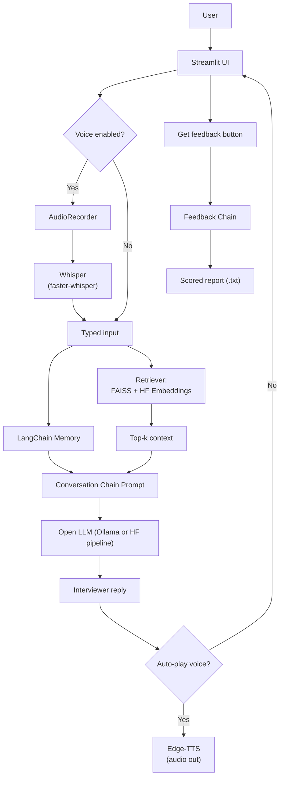

# GPT Interviewer 🎤
_AI‑powered mock interviews for tech roles — voice in, voice out, instant feedback._


---

## Table of contents
- [Highlights](#highlights)
- [Architecture](#architecture)
- [Prerequisites](#prerequisites)
- [Install & run](#install--run)
- [Environment config](#environment-config)
- [Usage](#usage)
- [Performance tips](#performance-tips)
- [Troubleshooting](#troubleshooting)
- [Project layout](#project-layout)
- [License](#license)

---

## Highlights

- **Three interview modes**
  - **Professional (JD‑based)** — paste a job description; the app builds a guideline and asks one focused technical question per topic.
  - **Behavioral** — STAR‑style soft‑skill questions with rubric‑based feedback.
  - **Résumé** — parse your PDF and drill into your actual experience.
- **Voice I/O** — local Whisper STT + Edge‑TTS for natural conversation.
- **Retrieval‑augmented** — Sentence‑Transformers embeddings → FAISS similarity search.
- **One‑click report** — strengths, gaps, and an overall score you can download.

---

## Architecture


<details><summary>ASCII fallback (if Mermaid is disabled)</summary>

```
User -> Streamlit UI -> (voice?) -> AudioRecorder -> Whisper -> text
text -> Memory + Retriever(FAISS+HF) -> Context
Context + History -> Prompt -> Open LLM -> Reply
Reply -> (autoplay?) -> Edge-TTS -> Audio
[Optional] "Get feedback" -> Feedback chain -> report.txt
```
</details>

---

## Prerequisites

- **Python**: 3.11.x recommended  
- **Optional Ollama** for local LLMs (`LLAMA3`, `mistral`, etc.) or use the built‑in CPU HF pipeline fallback
- **Optional GPU for STT (Whisper)** — tested on HP Victus (RTX 3060)
  - NVIDIA driver (recent)
  - CUDA Toolkit **12.x or 13.x**
  - cuDNN **9.x** (ensure `cudnn_ops64_9.dll` is on `PATH`)
  - _LLM calls are local (Ollama or CPU HF pipeline); GPU is only for Whisper._

---

## Install & run

```bash
# 1) Clone
git clone https://github.com/<your-username>/GPTInterviewer.git
cd GPTInterviewer

# 2) Create venv
python -m venv .venv
# Windows:
. .venv\Scripts\activate
# macOS/Linux:
# source .venv/bin/activate

# 3) Install deps
pip install -r requirements.txt

# 4) Run
streamlit run Homepage.py
```

**CUDA Whisper sanity check (PowerShell):**
```powershell
$code = @"
from faster_whisper import WhisperModel
try:
    WhisperModel("small", device="cuda", compute_type="float16")
    print("✅ CUDA Whisper OK")
except Exception as e:
    print("❌ CUDA Whisper failed:", e)
"@
python -c $code
```

---

## Environment config

Optional `.env` (for custom models):

```
# LLM backend (defaults: Ollama -> HF pipeline fallback)
LLM_BACKEND=ollama           # or hf
OLLAMA_MODEL=llama3
OLLAMA_BASE_URL=http://localhost:11434
HF_MODEL=sshleifer/tiny-gpt2 # tiny CPU-friendly fallback

# Embeddings
EMBED_MODEL=sentence-transformers/all-MiniLM-L6-v2

# STT settings (offline.py reads these)
WHISPER_MODEL=small          # tiny/base/small/medium/large-v3
WHISPER_DEVICE=cuda          # cuda or cpu
WHISPER_COMPUTE=float16      # float16 | float32 | int8_float16 | int8
```

---

## Usage

1. Open **Homepage** → pick **Professional**, **Behavioral**, or **Résumé**.
2. **Professional**: paste JD → toggle voice if you like → answer questions.
3. **Behavioral**: enter prompt/keywords → answer.
4. **Résumé**: upload PDF → pick position → answer.
5. Hit **Get feedback** any time to download a scored report.

---

## Performance tips

- **Chunking / retriever**: default overlap is tuned for medium JDs/resumes. If your prompts are huge, reduce chunk size or top‑k in code.
- **Turn cap**: each screen enforces **MAX_TURNS** to keep sessions ~10–15 min.
- **Voice off**: if your mic is flaky, disable voice to remove STT overhead.

---

## Troubleshooting

| Symptom | Fix |
|---|---|
| `cudnn_ops64_9.dll missing` | Ensure cuDNN `bin` is on PATH. Example (PowerShell): `setx PATH "$env:PATH;C:\Program Files\NVIDIA\CUDA\v13.0\bin;C:\Program Files\NVIDIA\CUDNN\v9.12\bin\13.0"` then open a **new** terminal. |
| `Requested int8_float16 compute type...` | Your backend doesn’t support that mix. Set `WHISPER_COMPUTE=float16` (GPU) or `float32` (CPU). |
| Ollama connection refused | Start the daemon: `ollama serve` (or install from https://ollama.com). |
| `Prompt is too long` | Your JD/résumé is huge. Reduce chunk size/overlap or lower retriever `k`. |
| `ModuleNotFoundError: streamlit_lottie` (or others) | `pip install -r requirements.txt` inside the **activated** `.venv`. |
| Repeating questions | Conversation uses message history + asked‑topics memory. If you still see repeats, increase MAX_TURNS or clear session state. |
| Git repo too big | Add `.venv/`, `models/**`, `*.dll`, `*.pyd`, `*.bin`, `*.safetensors` to `.gitignore`. Clean history: `git filter-repo --invert-paths --path .venv --path models --path '*.dll' --path '*.pyd' --path '*.bin' --path '*.safetensors'`. |

---

## Project layout

```
GPTInterviewer/
├─ Homepage.py                # entry screen (no internal hacks)
├─ pages/
│  ├─ Professional Screen.py  # JD-driven interview
│  ├─ Behavioral Screen.py    # soft-skill interview
│  └─ Resume Screen.py        # resume-driven interview
├─ prompts/
│  ├─ prompts.py              # templates
│  └─ prompt_selector.py      # per-position selectors
├─ speech_recognition/
│  └─ offline.py              # faster-whisper wrapper (CPU/GPU)
├─ tts/
│  └─ edge_speak.py           # Edge-TTS helper
├─ app_utils.py               # NLTK bootstrap, misc helpers
├─ requirements.txt
├─ .env.example
└─ .gitignore
```

---

## License

MIT © 2025 Souvik Ghosh
